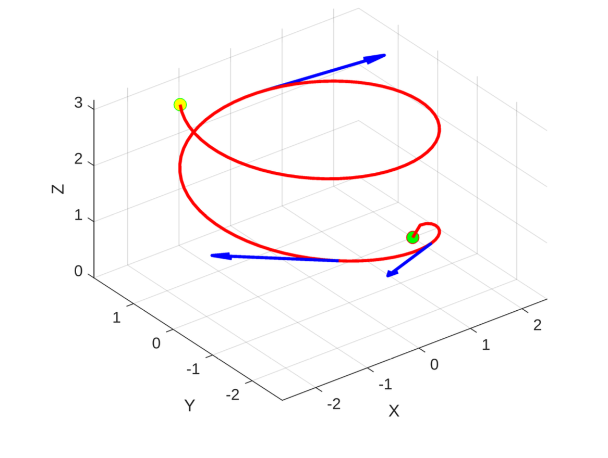

  

# About me (Tom)

Veteran, pilot, and mathematics student focused on applied modeling, statistical analysis, technical communication, and systems engineering.

## Technical Modeling Portfolio

My technical modeling portfolio includes selected public facing summaries of mathematics, statistics, and modeling projects completed using R, MATLAB, Python, and LaTeX.

The portfolio emphasizes:

- Regression modeling and statistical prediction
- Logistic regression and random forest classification
- Differential equations and dynamic systems
- Applied linear algebra, network flow, and matrix methods
- Singular value decomposition and image compression
- MATLAB-based visualization and numerical analysis
- Technical writing for mathematical and computational work

[View my full technical modeling portfolio](https://github.com/TheEigenTom/technical-modeling-portfolio)

## Selected Projects

### Predicting Student Performance Using Regression

Built interpretable regression models in R using the UCI Student Performance dataset. Compared behavioral predictors with academic history predictors using R², adjusted R², ANOVA, and residual diagnostics.

[View project](https://github.com/TheEigenTom/technical-modeling-portfolio/tree/main/projects/student-performance-regression)

### Statistical Modeling of Heart Disease Risk

Built and compared logistic regression and random forest models in R using a clinical heart disease dataset. Evaluated model fit and predictive performance using AIC, AUC, Hosmer-Lemeshow testing, confusion matrices, accuracy, precision, recall, and RMSE.

[View project](https://github.com/TheEigenTom/technical-modeling-portfolio/tree/main/projects/heart-disease-risk-modeling)

### Population Growth Modeling with Real-World Data

Developed MATLAB models comparing discrete, continuous, and carrying-capacity population models against U.S. population data from 1950-2022.

[View project](https://github.com/TheEigenTom/technical-modeling-portfolio/tree/main/projects/population-growth-modeling)

### Differential Equations and Dynamic Systems Modeling

Solved and visualized population, circuit, forced-response, and linear-system models using analytical methods and MATLAB tools including `dsolve`, `ode45`, eigenvalue/eigenvector analysis, phase portraits, Laplace transforms, and unit-step inputs.

[View project](https://github.com/TheEigenTom/technical-modeling-portfolio/tree/main/projects/differential-equations-dynamic-systems)

### Applied Linear Algebra: Network Flow and Image Compression

Modeled network throughput as a system of linear equations and applied SVD-based rank-k approximation to image compression.

[View project](https://github.com/TheEigenTom/technical-modeling-portfolio/tree/main/projects/applied-linear-algebra-network-flow-image-compression)

### Multivariable Calculus Visualization in MATLAB

Created 3D visualizations of planes, projectile motion, velocity vectors, normal vectors, tangent planes, and surfaces using MATLAB.

[View project](https://github.com/TheEigenTom/technical-modeling-portfolio/tree/main/projects/multivariable-calculus-visualization)

## Tom's Academic Integrity Note

This site links to curated public portfolio summaries. Full assignment prompts, instructor provided templates, complete solution files, and course specific materials are intentionally omitted.

## Contacting Tom

For application or professional review purposes, please use the contact information provided in my application materials or resume. Thanks for visiting! - Tom
